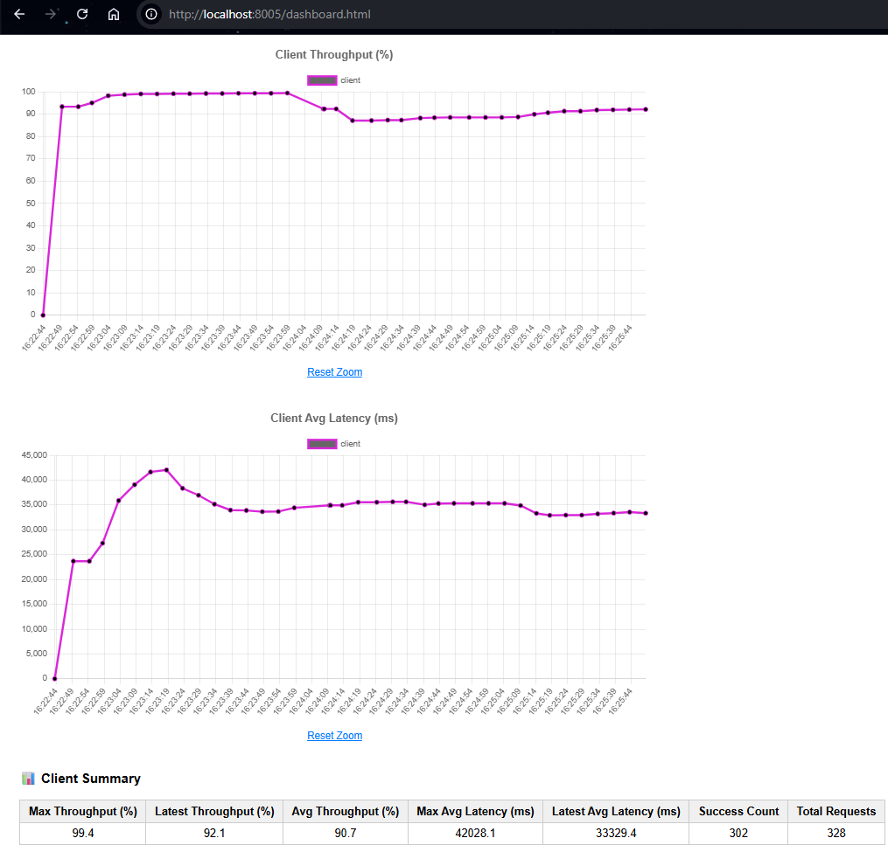
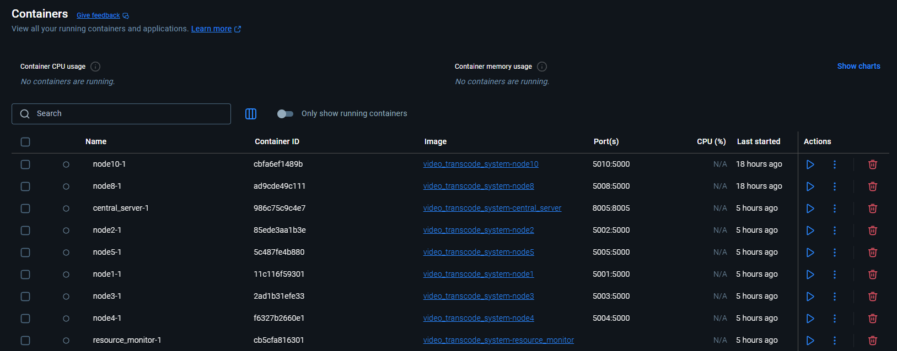
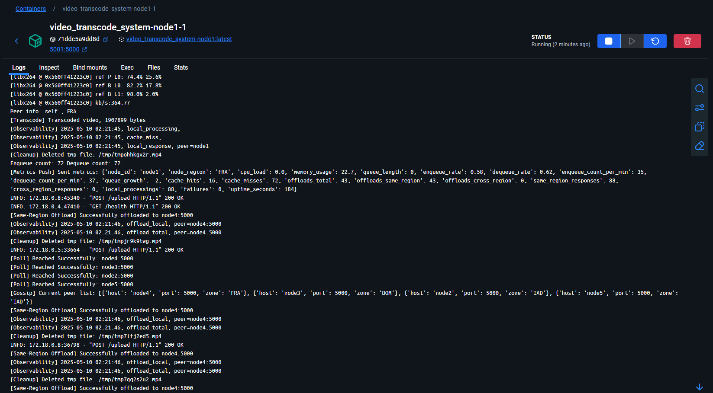
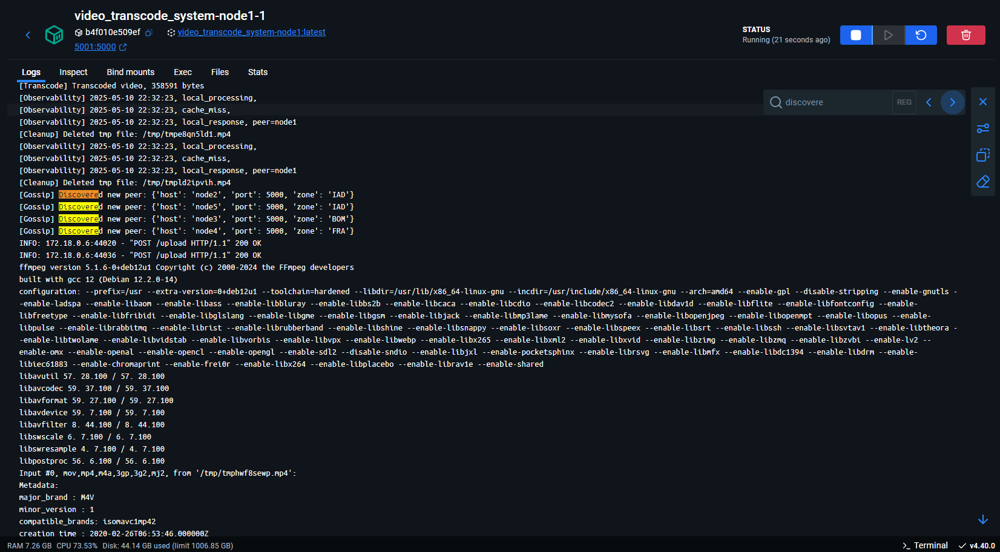
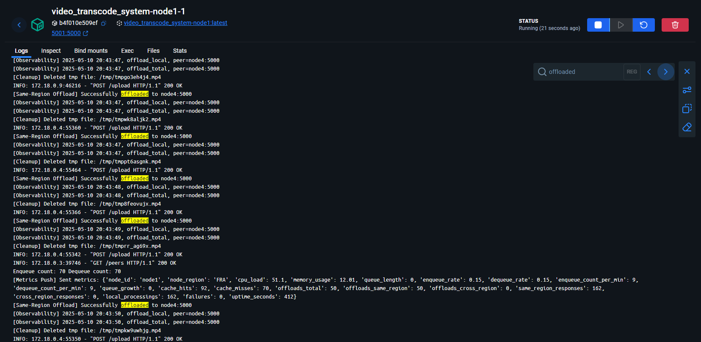
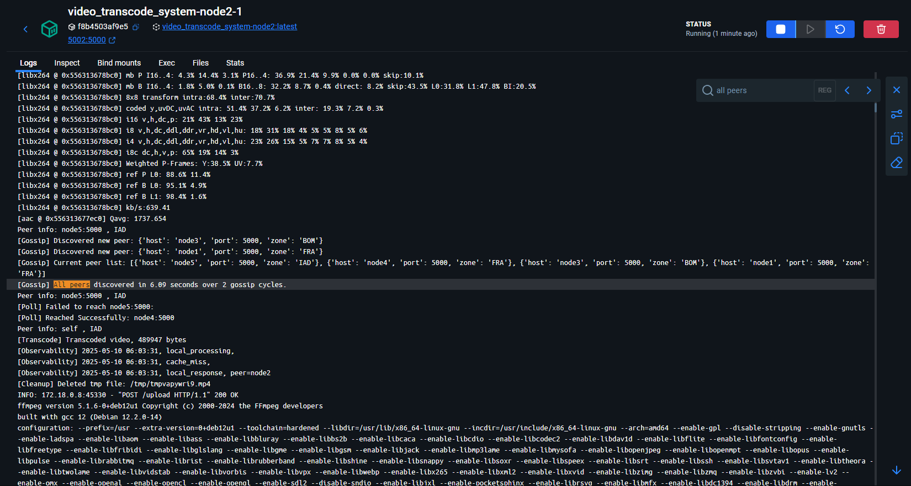
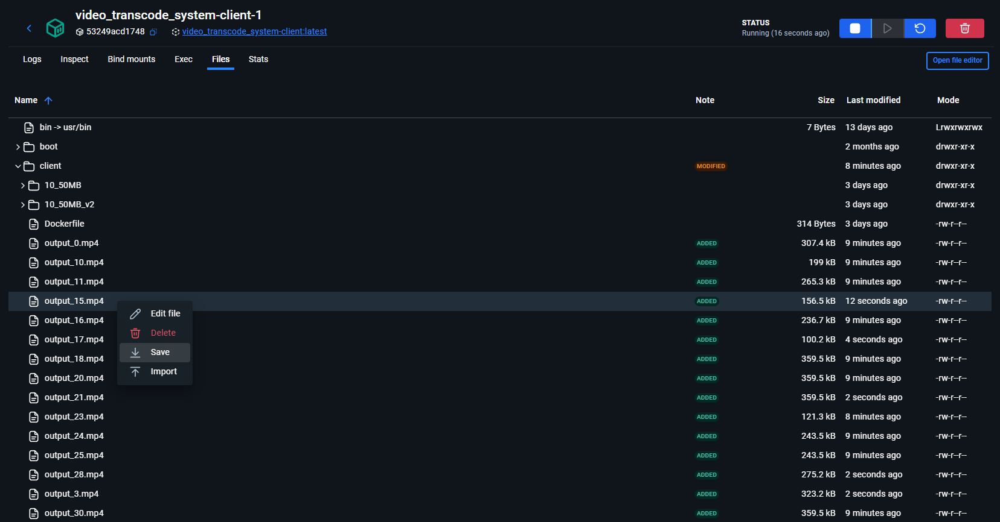

# Decentralized Video Transcoding System with Gossip-Based Peer Discovery
This project builds a decentralized, load-aware video transcoding system using FastAPI, Docker Compose, and lightweight observability. Nodes dynamically offload tasks based on CPU and queue metrics, cache transcoded videos, use gossip protocols to discover peers.
The goal of the project is to build a self-organizing, fault-tolerant system where nodes intelligently balance transcoding workloads without relying on any centralized scheduler service.

## Features

- Proximity- and load-aware offloading between nodes  
- Lightweight peer discovery with gossip protocol  
- Fully decentralized architecture (no central controller)  
- Real-time system metrics and observability dashboard  
- Simulated client load testing

## Prerequisites

- **Docker Desktop** → [Download Docker Desktop](https://www.docker.com/products/docker-desktop/)  
- If Using Windows we recommend setting up WSL 2 (Windows Subsystem for Linux)
- Official Documentation for setting up Docker Desktop WSL 2 backend on Windows: https://docs.docker.com/desktop/features/wsl/

> **Note:** This software was developed and tested in **WSL 2 on Windows**.

## Instructions to Run the Software:

- Clone this repo and cd to the repo directory
- Run the System: `docker compose up --build` (The initial run with `--build` takes a few minutes, for subsequent runs use the command: `docker compose up`)
    - This will start:
    - 5 transcoding nodes (node1 → node5)
    - A client container that sends video uploads every 5 seconds
    - A resource monitor container which ships cpu and memory metrics from node containers to the observability container
    - A central observability server (container) showing live metrics shipped from containers and the resource monitor

- The System Activity can be monitored in the observability dashboard. Access http://localhost:8005/ (This displays all live metrics of the system)

- The Container logs can be monitored in Docker desktop as shown below:

## Instructions for Empirical Evaluation of the Software:

### Comparing Random Offload Routing vs Our Score-based Offload Algorithm

- Under container_scripts directory, in main.py:
    - in line 322 un-comment the get_best_peer() function under the "Random Offloading" Comment.
    - comment the get_best_peer() function in line 358
- Run the docker compose application.
- In the dashboard (http://localhost:8005/) you can check the Client Metrics section for the throughput, latency. The offloads and Response related metrics are in a different section of the dashboard.
(The dashboard takes a few seconds to start showing the metrics)
- Now, revert to the original main.py script and run the docker compose application.
- Check the dashboard again for the same metrics and compare.

- This test requires 2 runs - one for Random offloading and one for our score based Offloading. Each run takes approx. 3 minutes, so 6 minutes in total for running this test. The timings are approx. and might vary depending on different host systems and available resources. So, alternatively, rather than tracking time, you can scroll down the dashboard and check the client metrics (throughput and latency) summary table in the dashboard. When the total requests hit 300 (when significant transcode requests have been sent) you can start checking the other metrics in dashboard.
- Results / Expected behaviour is shown in our report (CS553_Decentralized_Transcoder_System_sj1230_hr458_lk671.pdf) under analysis section for this test. Refer pages 6,7,8 (Section 6 and 7) in the report for this test.

### Comparing Round-Robin Offload Routing vs Our Score-based Offload Algorithm

- Under container_scripts directory, in main.py:
    - in line 338 un-comment the get_best_peer() function under the "Round-Robin offloading" Comment.
    - comment the get_best_peer() function in line 358
- Rest of the steps and the test duration remain the same as the previous test. 
- Results / Expected behaviour are shown in our report under analysis section for this test. Refer pages 9,10,11 (Section 8 and 9) in the report for this test.

### Fault Tolerance test (1 node i.e 20 % infrastructure down scenario)

- Run the docker compose app
- Check the dashboard for CPU metrics (The dashboard takes a few seconds to start showing the metrics)
- Stop one of the nodes which have significant CPU load by doing -> `docker stop <container_id>`
- Check container id of node containers in docker desktop:

- You can make sure the stopped node is down by checking the CPU % (0.0 %) for that node in the dashboard.
- Check the latency and throughput metrics (graphs and tables) in dashboard.
- Start the node back up with: `docker compose up -d <container_id>`
- Check node container logs in docker desktop - the container will discover it's peers and start accepting requests / offloads without any manual intervention.

- Gossip discovery of peers:

- Accepting and offloading requests:

- The test duration is around ~6 minutes.
- Results / Expected behaviour are shown in our report under analysis section for this test. Refer pages 11,12,13 (Section 10.1) in the report for this test.

### Fault Tolerance test (2 node i.e 40 % percent infrastructure down scenario)

- Similar to previous step but need to bring down 2 node containers.
- Results / Expected behaviour are shown in our report under analysis section for this test. Refer pages 13,14 (Section 10.2) in the report for this test.

### Evaluating Offload Behavior Under Regional Saturation: RTT vs Load Bias

#### RTT biased Offloading (Default Behavior)

- In client/smart_upload.py comment line 78 and uncomment line 81. This is to simulate a local overload (send requests only to nodes in FRA region)
- Run the Docker Compose application - the offloading is RTT biased by default.
- Check the throughput, latency, offloads and responses and queue metrics in dashboard. Refer report to see reasoning and results based on these metrics.
(The dashboard takes a few seconds to start showing the metrics)
- The test duration is around ~3 minutes. The timings are approx. and might vary depending on different host systems and available resources. Alternatively, rather than tracking time, you can scroll down the dashboard and check the client metrics (throughput and latency) summary table in the dashboard. When the total requests hit 300 (when significant transcode requests have been sent) you can start checking the other metrics in dashboard.
- Results / Expected behaviour are shown in our report under analysis section for this test. Refer RTT Biased Routing (Section 11 -> pages 14,15,16) in the report for this test.

#### Load biased Offloading

- In client/smart_upload.py comment line 78 and uncomment line 81. This is to simulate a local overload (send requests only to nodes in FRA region)
- In container_scripts/client comment line 403 and uncomment 404 to simulate offloading biased towards lesser load (cpu + memory + job_queue_length)
- Rest of the steps and the test duration are similar to previous RTT biased offloading experiment.
- Results / Expected behaviour are shown in our report under analysis section for this test. Refer Load Biased Routing (Section 11 -> pages 16,17,18) in the report for this test.

### Gossip Protocol Convergence Test:

- For this test run the docker compose app with different config file: `docker compose -f docker-compose_ring_5.yml up --build`
- Check each of the 5 node containers logs and search for the entry "All peers discovered" - this can be done in docker desktop as shown below:

- This gives us the time and number of gossip cycles the node needed to discover all peer nodes.
- The test duration is around ~3 minutes
- Results / Expected behaviour are shown in our report under analysis section for this test. Refer Section 12 -> pages 18,19 in the report for this test.

## To check Transcoded Video Outputs:

- Access Client container's filesystem in Docker Desktop as shown below, and save one of the transcoded output video files (the transcoded response sent from the system node containers) to host system.

- If you open the video file to view, you can notice that resolution is very low (the default task assigned to the transcoding system is to resize the video resolution to 360p)
